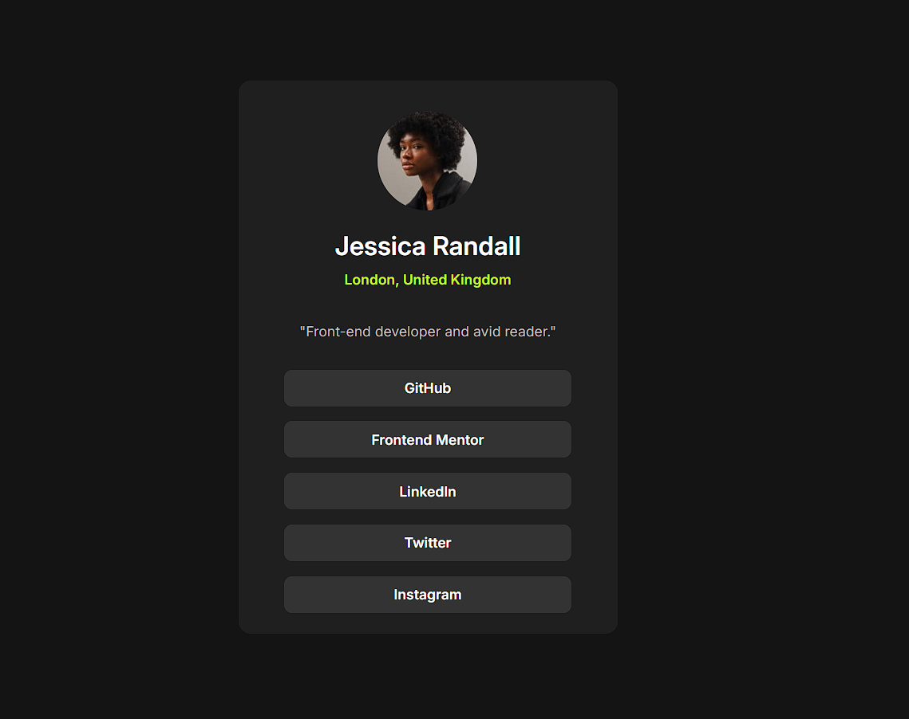

# 👤 Social Links Profile — Frontend Mentor Challenge

This is my solution to the [Social Links Profile challenge]() on Frontend Mentor.  
It’s a simple, centered profile card with links to different platforms, styled with hover states and a clean responsive design.

## 🚀 Live Site  
Check out the hosted version here: [Live Preview]()

## 🛠️ Built With
- HTML5  
- CSS3  
- Flexbox  
- Google Fonts (Inter)

## 📸 Screenshot

## 🎯 What I Learned
- Better control of **spacing and sizing** using `clamp()` and fixed widths  
- Creating reusable **button-like links** with hover and focus states  
- Using **Flexbox** for vertical alignment and centering  
- Fine-tuning **font weights and hierarchy** for cleaner typography  
